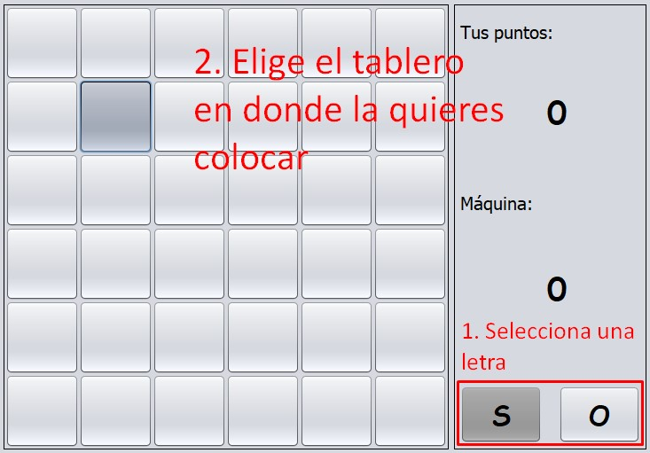

# Juego El OSO  

## 1. Acerca del juego

- Considerado un tres en raya extendido.  

- La idea del juego es lograr formar la mayor cantidad de palabras "OSO" posible, colocando las letras "O" o "S" por turno. Si un jugador logra formar una palabra "OSO", continúa jugando.  

- En esta versión del juego, jugarás contra la máquina.

- El juego termina cuando el tablero se llena y gana el jugador que haya logrado completar la mayor cantidad de palabras "OSO".

 >Para mayor información del juego, visita [esta página](https://es.wikipedia.org/wiki/Oso_(juego)).

## 2. Instrucciones

- Al iniciar, podemos elegir un tablero de alguna de las siguientes dimensiones.  


- Luego, eligiremos quién empieza a colocar las letras.


- Para colocar una letra, selecciónala y da clic en el casillero en donde quieras colocarla.


- Los movimientos de la máquina se pintan de amarillo. Tus movimientos en celeste.


- **Juego en funcionamiento (Derrota inminente).**


## 3. Tecnologías  

- La interfaz del juego está implementada en Java 8.  
- La lógica de las jugadas de la máquina está implementada en [LISP](https://www.davidam.com/docu/un-lenguaje-en-diez-minutos.html).  

## 4. Sobre el algoritmo de Inteligencia Artificial

- El algoritmo implementado es el denominado "Primero el mejor".  
- En cada movimiento, la computadora evalúa sus posibilidades, y elige la mejor opción a partir de una función de evaluación (puntos a ganar en el siguiente movimiento).  

## 5. Puesta en marcha

- Para ejecutar el programa debes primero agregar a tu proyecto las liberías de la carpeta **lib/**. Estas contienen un intérprete de LISP para poder ejecutarlo en Java.

- Ejecutar la función ```main``` de la clase ```InicioFrame.java```.

**Contáctame:**

[](https://twitter.com/bgamas_) [](https://pe.linkedin.com/in/bryan-gama-solórzano-a7bb58175)
